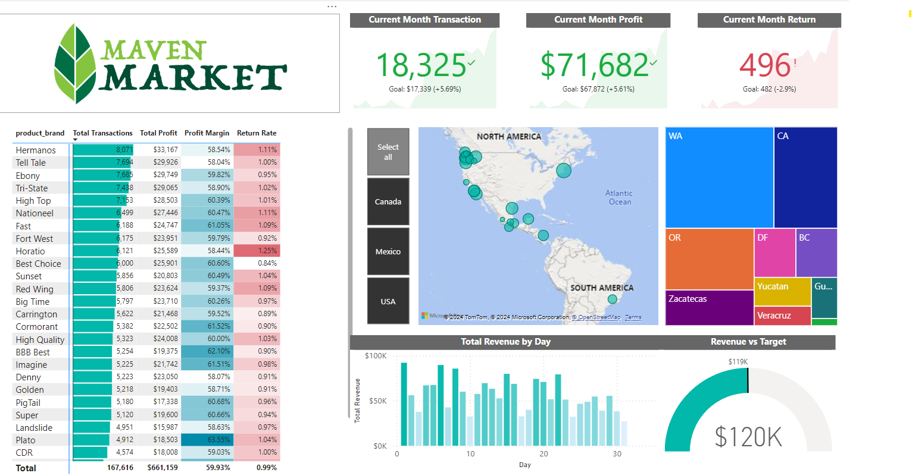

# MavenMarket

A Microsoft Power BI business intelligence dashboard for AdventureWorks, a fictional global manufacturing company that produces cycling equipment and accessories.

The dataset was supplied with the [Maven Analytics Power BI Desktop course](https://mavenanalytics.io/course/microsoft-power-bi-desktop). 

## Features

- Track key performance indicators (KPIs) related to transactions, profit, and returns.
- Compare performance across different regions.
- Analyse product-level trends.

## Project Highlights

This project involved the following tasks:

- Connecting and transforming data 
- Building a relational data model
- Creating calculated columns and measures using **DAX**
- Created a rolling calendar using **PowerQuery M code**
- Building an interactive dashboard
